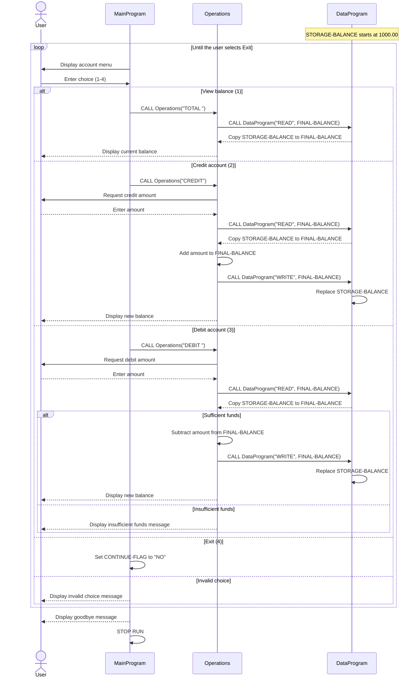

# Student Account COBOL Programs

This directory documents the COBOL programs in `src/cobol`. Together, they
provide a menu-driven student account system that maintains a single account
balance during program execution.

## Program Overview

### `main.cob` - MainProgram

`MainProgram` provides the interactive user interface and controls the main
program loop.

Key functions:

- Displays the account management menu.
- Accepts a menu choice from the user.
- Calls `Operations` with the requested operation:
  - `TOTAL` (padded to six characters) to view the balance.
  - `CREDIT` to add funds.
  - `DEBIT` (padded to six characters) to subtract funds.
- Exits when the user selects option 4.
- Displays an error for choices outside the range 1 through 4.

### `operations.cob` - Operations

`Operations` implements the account actions requested by `MainProgram`. It
receives a six-character operation code through its linkage section.

Key functions:

- `TOTAL` (padded to six characters): Reads and displays the current balance.
- `CREDIT`: Reads a credit amount, adds it to the balance, writes the updated
  balance, and displays the result.
- `DEBIT` (padded to six characters): Reads a debit amount, checks available funds, and writes the
  reduced balance when the debit is allowed.

### `data.cob` - DataProgram

`DataProgram` is the account data component. It receives an operation code and
the balance through its linkage section and stores the balance in working
storage.

Key functions:

- `READ`: Copies the stored account balance into the caller's `BALANCE` field.
- `WRITE`: Replaces the stored account balance with the caller's `BALANCE`.
- Initializes the stored balance to `1000.00` when the program starts.

## Student Account Business Rules

- The account starts with a balance of `1000.00`.
- A credit increases the current balance by the amount entered by the user.
- A debit is permitted only when the current balance is greater than or equal
  to the requested debit amount.
- If a debit exceeds the current balance, no balance change is written and the
  user sees `Insufficient funds for this debit.`
- Successful credits and debits persist the updated balance through
  `DataProgram`.
- The current implementation manages one balance and does not identify
  individual students or store account records between program executions.
- Amounts use a numeric format with two decimal places (`PIC 9(6)V99`).

## Program Flow

```text
MainProgram
    -> Operations (TOTAL, CREDIT, or DEBIT)
        -> DataProgram (READ or WRITE)
```

Operation codes are six characters long. `TOTAL` and `DEBIT` are passed with
trailing padding spaces, which is significant because the COBOL fields use
`PIC X(6)`.

## Sequence Diagram


